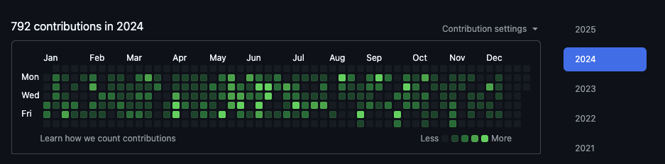

# GitGhost

GitGhost is a command-line tool that mirrors your Git activity from one repository to another, allowing you to synchronize your commit history from a private repository (e.g., on GitLab) to a dummy repository on GitHub.

This helps maintain a more accurate graph to show your real coding habits without exposing your private repository's contents to a third party service.

GitHub activity graph before using GitGhost:


GitHub activity graph after syncing work activity using GitGhost:


## Features

- Dummy Repository Setup: Easily set up a dummy repository for syncing commits.
- Commit Filtering: Sync commits only from specific authors.
- Accurate Commit Dates: Preserves the original commit and committer dates.
- Progress Bar: Provides real-time feedback on the commit synchronization process.
- Secure Execution: Handles private repositories securely by inheriting SSH keys and terminal configurations.

## Installation

Using Composer, you can install GitGhost globally with the following command:

```bash
composer global require imliam/gitghost
```

Alternatively, you can use [cpx](https://cpx.dev) to run GitGhost:

```bash
cpx imliam/gitghost <arguments>
```

Once installed, you need to run the setup command to configure GitGhost. This will help prompt you to set up your dummy repository and determine which authors to commit from and to:

```bash
gitghost setup
```

You can find the generated configuration file at `~/.gitghost.json`, or rerun the setup command to make changes to it.

## Usage

Once all set up, use the `sync` command and pass in the path of the local repository you want to mirror your commit history from:

```bash
gitghost sync /path/to/local/repository
```

This will recreate the git history by making commits dated into the past to the dummy repository and push them to the remote repository.

Running this command again at a later date will only sync new commits repo.

Once a repository is synced for the first time, it is added to an internal list of repositories. You can run the `syncall` command to sync all repositories in the list without needing to specify each path individually.

```bash
gitghost syncall
```